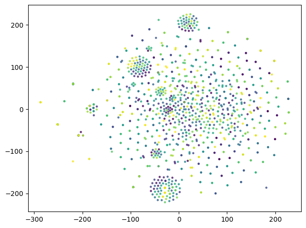
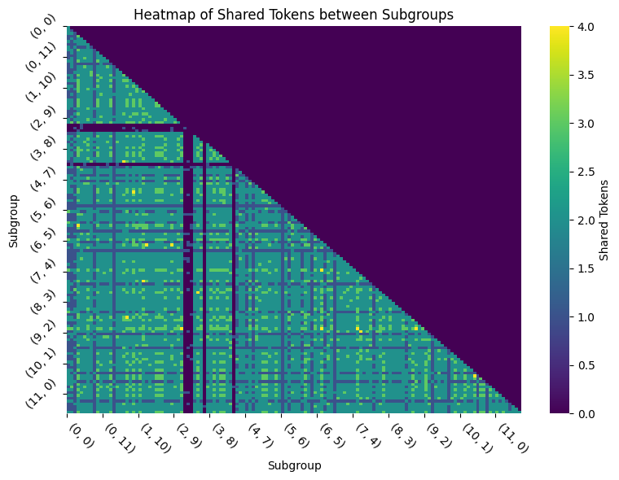

Interpretability experiments
---

I'm currently focused on exploring what I've dubbed attention tokens, which are generated by unembedding the components of attention heads by directly projecting them on to the residual stream without going through the MLP blocks. This results in a surprisingly compact and stable representation over, seemingly, arbitrary inputs. Further, sparse connections between heads exist by shared attention tokens.

The plot on the left shows the t-SNE of the embeddings of the element-wise Q*K attention tokens. The plot on the right shows how heads are connected by number of shared QK attention tokens.

    
    

